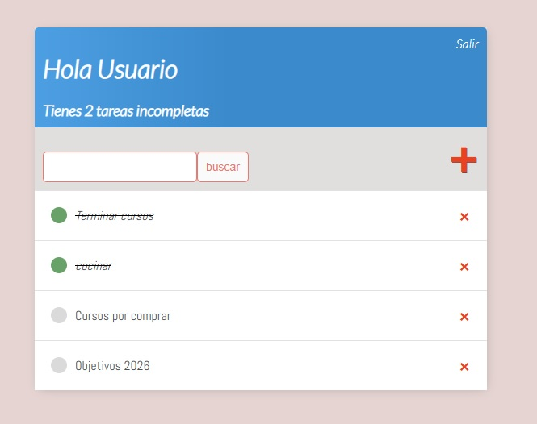

# Sistema de Gestión de Tareas con Django

Aplicación web completa para la gestión de tareas personales ("To-Do List"), desarrollada con Python y Django. Permite a los usuarios registrarse, iniciar sesión y administrar sus propias tareas de forma privada.

## 🚀 Características

* **Autenticación de Usuarios:** Sistema completo de Registro, Login y Logout.
* **Gestión de Tareas (CRUD):** Crear, Leer, Actualizar y Eliminar tareas.
* **Privacidad de Datos:** Cada usuario solo puede ver y editar sus propias tareas.
* **Búsqueda:** Barra de búsqueda integrada para filtrar tareas por título.
* **Interfaz Gráfica:** Diseño limpio y responsivo utilizando CSS personalizado.

## 🛠️ Tecnologías Utilizadas

* **Backend:** Python, Django 5.
* **Frontend:** HTML5, CSS3.
* **Base de Datos:** SQLite (por defecto en Django).
* **IDE:** PyCharm.

## 📸 Vistas del Proyecto

El proyecto incluye vistas protegidas que requieren inicio de sesión (`@login_required`) y formularios personalizados para la gestión de datos.

---
**Autor:** Gastón

